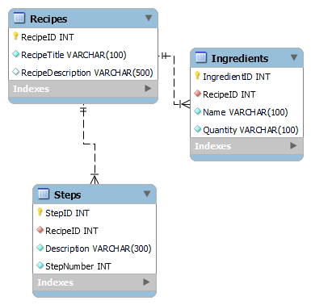
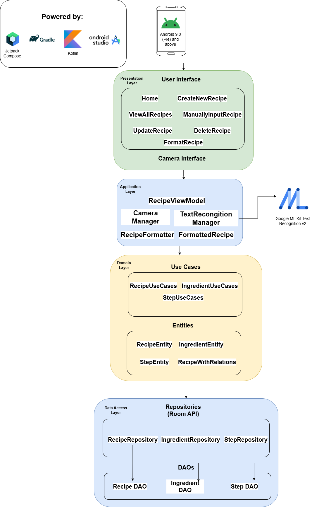
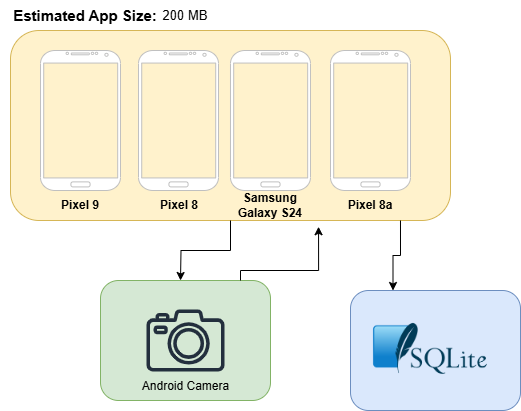
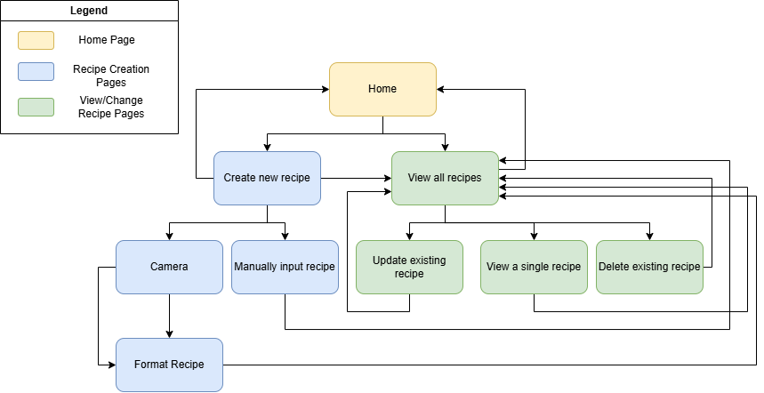

# Architecture and Design

This page outlines the technical architecture and design decisions behind the Digital Cookbook Creator application. It includes an overview of the app's structure, layers, data flow, supporting diagrams, and navigation design.

---

## Technical Architecture

The application follows an N-Layer Architecture approach, structured into four main layers:

- **Presentation Layer**  
  Contains UI logic built with Jetpack Compose. This includes theming (Color.kt, Theme.kt, Type.kt) and UI screens such as HomeScreen.kt, CreateNewRecipeScreen.kt, and FormatRecipeScreen.kt. These screens observe state from the ViewModel and display information to the user.

- **Application Layer**  
  Contains the RecipeViewModel, CameraManager, TextRecognitionManager, RecipeFormatter, and FormattedRecipe. This layer handles screen state, validation, camera capture, and text recognition logic.

- **Domain Layer**  
  Defines the core business logic. It includes usecase classes (RecipeUseCase, IngredientUseCase, StepUseCase) and entity classes (RecipeEntity, IngredientEntity, StepEntity, RecipeWithRelations).

- **Data Layer**  
  Responsible for local data persistence. It includes Room database configuration (AppDatabase.kt), DAO interfaces, repositories, and custom exceptions. Repositories abstract the database logic through classes like RecipeRepository and IngredientRepository.

### ER Diagram  
Describes the schema of the SQLite database used by Room. It includes three tables: (Recipes, Ingredients, and Steps) with clear one-to-many relationships. Foreign keys link ingredients and steps to their respective recipes, enabling normalized data storage.  

### UML Class Diagrams  
This UML class diagram provides a comprehensive view of the architecture and class relationships within the application. It shows how the RecipeViewModel connects UI screens to domain use cases, which interact with repositories, DAOs, and Room entities. Supporting classes like CameraManager, TextRecognitionManager, and RecipeFormatter handle image capture, OCR, and recipe formatting.

### Logical Solution Design Diagram  
Shows the high-level structure and flow between layers: Presentation → Application → Domain → Data.  

### Physical Solution Design Diagram  
Depicts how the app runs on supported Android devices and handles image processing and storage locally. It demonstrates the offline-first approach and compatibility with devices like Pixel 9, Pixel 8, and Samsung Galaxy S24.  

---

## Design Patterns and Practices

- **MVVM (Model-View-ViewModel)**  
  The app uses MVVM to separate UI (Jetpack Compose) from logic (ViewModel) and data (Repositories/UseCases). RecipeViewModel acts as a single source of truth for each screen.

- **Dependency Injection (Manual)**  
  The application includes a dedicated di (Dependency Injection) package, which provides and manages dependencies across the application. This project implements manual dependency injection through a centralized DependencyContainer.kt class. This class is responsible for instantiating key components such as repositories, use cases, and data sources, and passing them to where they are needed — such as the ViewModel layer.

  **Benefits of This Approach:**
  - Improves modularity and separation of concerns  
  - Makes testing easier by allowing mock implementations to be swapped in  
  - Keeps the app lightweight and avoids adding external libraries for DI

- **Reactive State Management**  
  The app uses `MutableStateFlow` to expose ViewModel data to the UI in a reactive way, enabling real-time updates to the screen.

### Component Diagram  
This component diagram outlines the screens of the application and their responsibilities. Each screen is documented with a summary of its purpose, state management responsibilities, and underlying logic. Arrows indicate navigation flow, showing how users move between screens during recipe creation, editing, viewing, and deletion.

---

## Navigation Structure

The app uses Jetpack Compose’s NavController to navigate between:

- HomeScreen.kt  
- CreateNewRecipeScreen.kt 
- ManuallyInputRecipeScreen.kt 
- CameraScreen.kt → FormatRecipeScreen.kt  
- ViewAllRecipesScreen.kt → ViewASingleRecipeScreen.kt / UpdateRecipeScreen.kt / DeleteRecipeScreen.kt

### Sitemap Diagram  
The sitemap visually represents the navigation flow between screens. It starts at the Home screen and branches into recipe creation (camera or manual input) and recipe management (view, update, delete). This design ensures all key features are accessible in three or fewer clicks from the home screen.  

---

## User Interface Wireframes

The wireframes demonstrate the layout of each screen. They include HomeScreen, CreateNewRecipeScreen, ViewAllRecipesScreen, FormatRecipeScreen, and UpdateRecipeScreen, all structured for usability and consistency.
These visuals helped shape the UI built with Jetpack Compose and support accessibility across screen sizes.  

